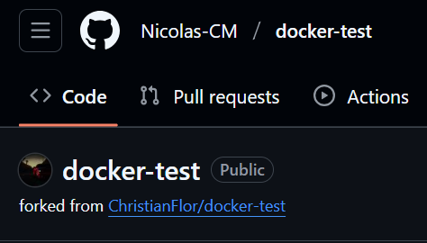
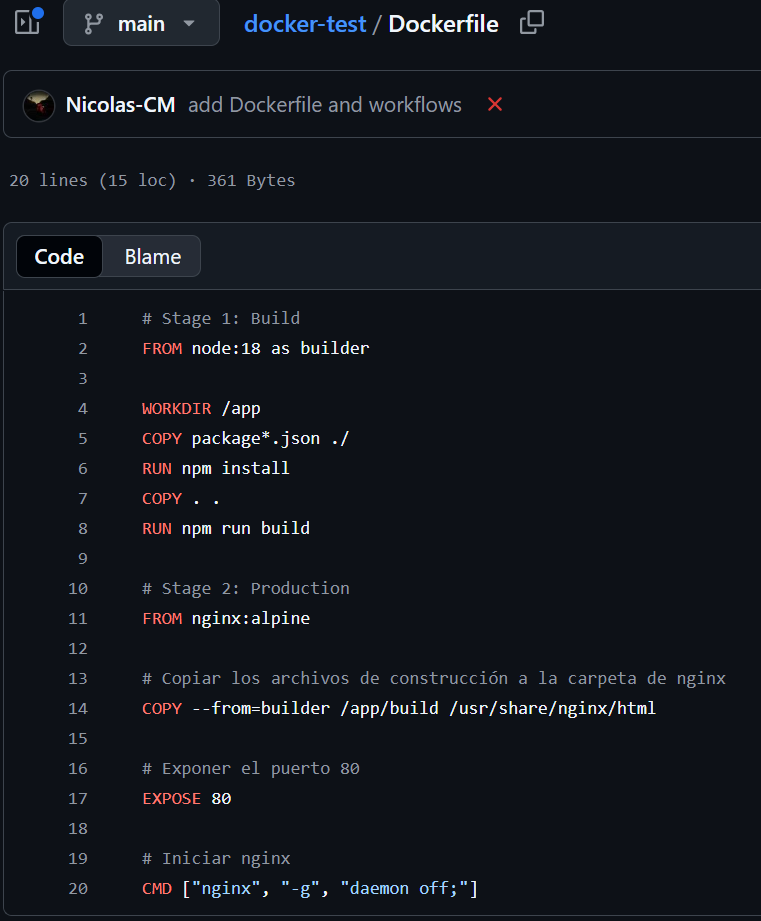
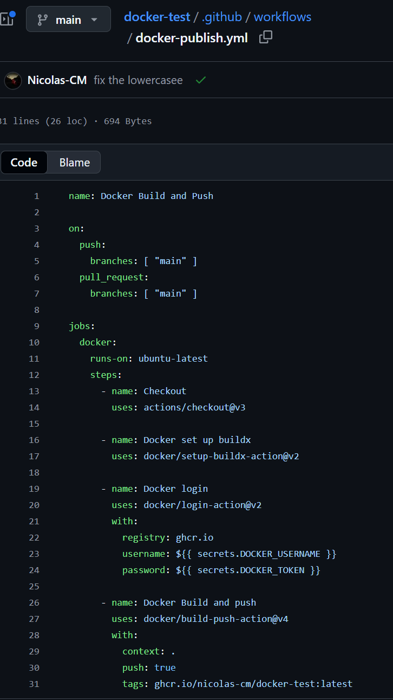
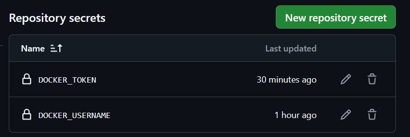
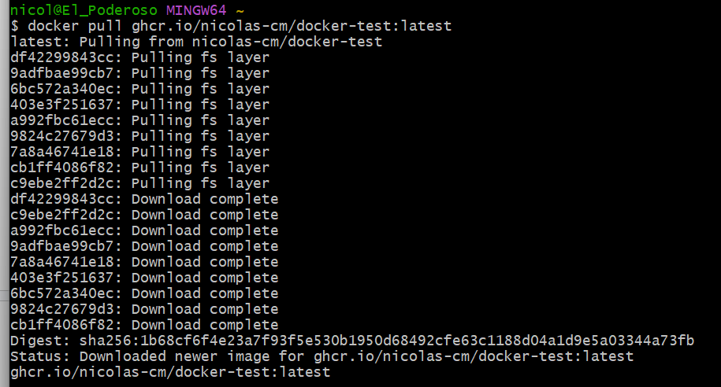
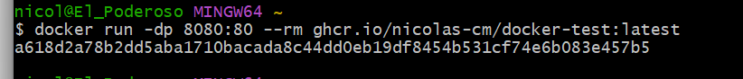
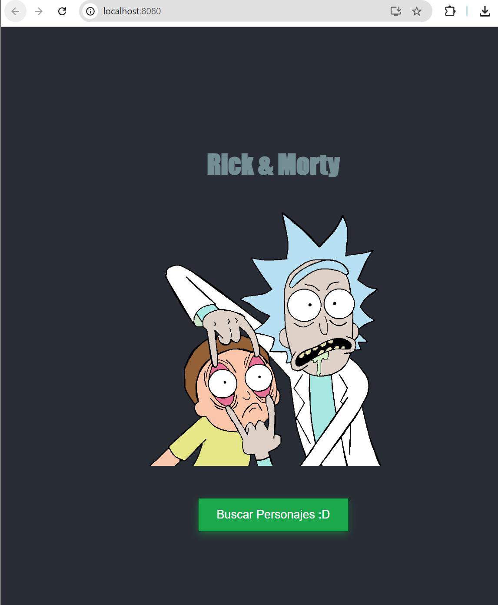
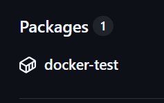
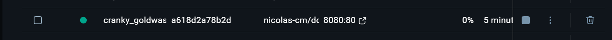

# Rick and Morty Character Viewer - Reporte de Implementación Docker

Se configuró Docker y GitHub Actions para CI/CD sobre una aplicación React existente que consume la API de Rick and Morty, permitiendo visualizar información sobre los personajes de la serie.

## Proceso de Implementación

### 1. Fork del Repositorio
Se realizó un fork del repositorio original para obtener una copia independiente del código base:


### 2. Dockerfile
Se implementó un Dockerfile multi-stage para optimizar el tamaño de la imagen final. Esta estrategia permitió separar el proceso de construcción del entorno de producción:


```dockerfile
# Stage 1: Build
FROM node:18 as builder
WORKDIR /app
COPY package*.json ./
RUN npm install
COPY . .
RUN npm run build

# Stage 2: Production
FROM nginx:alpine
COPY --from=builder /app/build /usr/share/nginx/html
EXPOSE 80
CMD ["nginx", "-g", "daemon off;"]
```

### 3. GitHub Actions Workflow
Se configuró un workflow de CI/CD para automatizar la construcción y publicación de la imagen Docker:


Se implementaron los siguientes pasos en el workflow:
- **Checkout**: Se realizó la clonación del repositorio
- **Docker set up buildx**: Se configuró el builder de Docker
- **Docker login**: Se estableció la autenticación con GitHub Container Registry mediante secretos
- **Docker Build and push**: Se ejecutó la construcción y publicación de la imagen

### 4. Secretos de GitHub
Se configuraron los secretos necesarios en el repositorio para manejar la autenticación de forma segura:


### 5. Descarga de la Imagen
Después de que el workflow publicó la imagen exitosamente, se descargó usando:


```bash
docker pull ghcr.io/nicolas-cm/docker-test:latest
```

### 6. Ejecución
Se ejecutó la aplicación en el ambiente local con:


```bash
docker run -p 80:80 ghcr.io/nicolas-cm/docker-test:latest
```

### 7. Visualización Local
Evidencia del contenedor corriendo localmente:


### 8. Publicación del Package
Se generó y publicó exitosamente el package en GitHub Container Registry:



## Arquitectura Implementada
En la implementación se utilizó:
- Aplicación React existente para el frontend
- API de Rick and Morty para obtener los datos
- Docker para contenerizar la aplicación
- GitHub Actions para automatizar el CI/CD
- GitHub Container Registry como repositorio de imágenes



## Tecnologías Implementadas
Para este proyecto se utilizaron:
- Aplicación React 18 existente
- Docker para la contenerización
- GitHub Actions para la automatización
- GitHub Container Registry para almacenar las imágenes
- Nginx como servidor web en producción